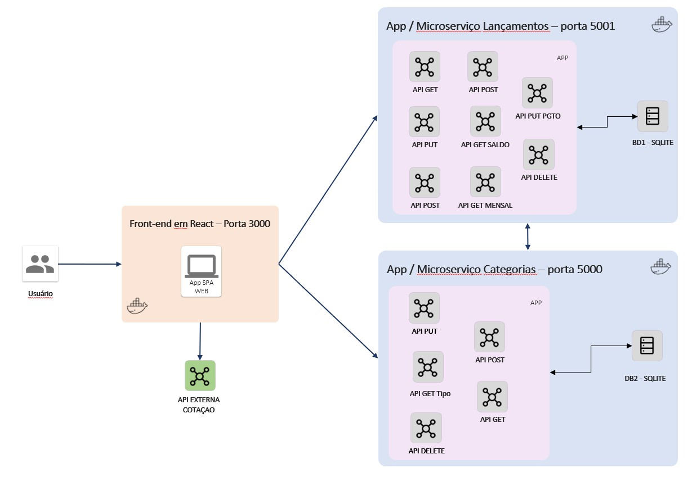

# MVP Sprint 03

Este é o MVP da sprint 03 do curso de **Engenharia de Software** da **PUC-Rio**

O objetivo aqui é disponibilizar o projeto de backend, onde foi desenvolvido um controle simples de despesas.

Linkendin: https://www.linkedin.com/in/tatianepr/

## Principais Funcionalidades

- cadastro de despesas e receitas
- cálculo automático do saldo atual mensal, total de receitas e despesas pagas no mês
- manutenção de categorias
- cadasto, edição e exclusão de despesas e receitas
- marcar uma despesa ou lançamento como "pago".
- visualização da cotação do Dólar, Euro e Bitcoin


## Arquitetura do projeto

Foi desenvolvido um frontend em REACT que chama os dois componentes escritos em Python. 

- Frontend REACT (porta 3000) -> https://github.com/Tatianepr/easybills-front
- Componente Categoria (porta 5000) -> https://github.com/Tatianepr/easybills_back_categoria (esse)
- Componente Lançametos (porta 5001) -> https://github.com/Tatianepr/easybills_back_lancamentos 

Além disso, o front-end chama uma API externa abaixo, responsável por fornecer cotações atualizadas do Dólar, Euro e Bicoin.

- Documentação da API Externa -> https://github.com/raniellyferreira/economy-api




## Como executar 

```
 npm start

```

 ## Como executar através do Docker

 Certifique-se de ter o [Docker](https://docs.docker.com/engine/install/) instalado e em execução em sua máquina.

Navegue até o diretório que contém o Dockerfile e o requirements.txt no terminal.
Execute **como administrador** o seguinte comando para construir a imagem Docker:

```
$ docker build -t easybills .
```

Uma vez criada a imagem, para executar o container basta executar, **como administrador**, seguinte o comando:

```
$ docker run -p 3000:3000 easybills
```

Uma vez executando, para acessar a aplicação, basta abrir o [http://localhost:3000](http://localhost:3000) no navegador.
